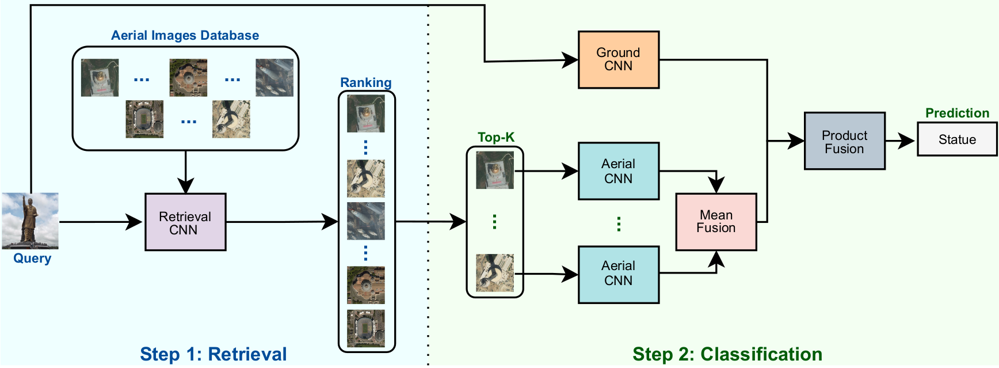
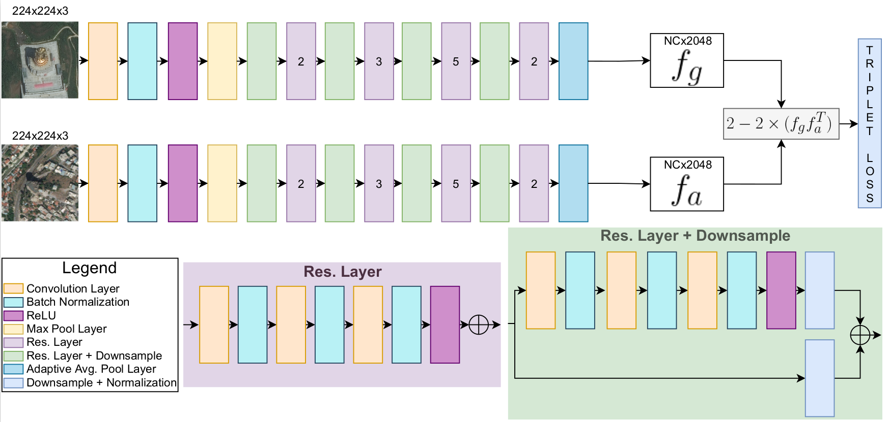

# Facing the Void: Overcoming Missing Data in Multi-View Imagery

## Overview
This repository contains code developed for the paper "Facing the Void: Overcoming Missing Data in Multi-View Imagery". 

It contains all the source code of the framework proposed for the paper. It also contains the dataset division proposed for this work, so it can be used as a baseline for future multi-view missing data experiments.

An overview of the framework can be checked in the image below:



### Retrieval Network
The architecture of the network integrated into this framework can be checked below:


## Instructions to run the code

Before running any step it is necessary to install all the requirements listed in 'requirements.txt'.

### Image Classification
All the necessary codes to train the classification models are located in the folder 'classification'. 

To train classification models, run the following command:

```diff
python classification/train.py --dataset_path <PATH_TO_DATASET_FOLDER> --output_path <PATH_TO_FOLDER_THAT_RESULTS_WILL_BE_SAVED> --batch <BATCH_SIZE> --epochs <TOTAL_EPOCHS> --network_type <CHOOSE_BETWEEN:[resnet,vgg,densenet,alexnet,squeezenet,inception,seresnet,sknet]> --early_stop <EPOCHS_WITHOUT_IMPROVING_TO_STOP_TRAINING> --fine_tunning_imagenet <[True/False]> --image_type <[aerial/ground]>
```

### Retrieval
All the necessary codes to train the retrieval models are located in the folder 'metric_learning'.

To train retrieval models, run the following command:

```diff
python metric_learning/train.py --aerial_path <PATH_TO_AERIAL_IMAGES_DATASET> --ground_path <PATH_TO_GROUND_IMAGES_DATASET> --output <PATH_TO_FOLDER_THAT_RESULTS_WILL_BE_SAVED> --epochs <TOTAL_EPOCHS>
```
**Note:** You may want to save the terminal logs in order to use the 'select_best_model_from_log.py' script. 

To get the best models using the training log, run the following command:

```diff
python metric_learning/select_best_model_from_log.py --log_path <PATH_TO_TRAIN_LOG_FILE>
```

To generate metric results, get the classification lists (necessary to perform missing data classification), distance matrices, and the (aerial and ground) descriptors, run the following code:

```diff
python metric_learning/test.py --aerial_path <PATH_TO_AERIAL_IMAGES_DATASET> --ground_path <PATH_TO_GROUND_IMAGES_DATASET> --output <PATH_TO_FOLDER_THAT_RESULTS_WILL_BE_SAVED> --model_path <PATH_TO_MODEL_FILE_THAT_WILL_BE_USED>
```

### Missing Data Classification
All the necessary codes to run classification with missing data are located in the folder 'missing_data_classification'.
After training the classification and retrieval models. Assuming that you already have the classification lists (last step detailed in Retrieval section), you can perform missing data classification running the following command:

```diff
python missing_data_classification/predict.py --aerial_model <PATH_TO_AERIAL_CLASSIFICATION_MODEL> --ground_model <PATH_TO_GROUND_CLASSIFICATION_MODEL> --aerial_data_path <PATH_TO_AERIAL_IMAGES_DATASET> --ground_data_path <PATH_TO_GROUND_IMAGES_DATASET> --ranking_file_path <PATH_TO_RANKING_FILE> --output_path <PATH_TO_FOLDER_THAT_RESULTS_WILL_BE_SAVED> --query_type <[ground/aerial]> --ranking <RANKING_SIZE> --net_type <CHOOSE_BETWEEN:[resnet,vgg,densenet,alexnet,squeezenet,inception,seresnet,sknet]>
```

### Important Notes
**If you use a different dataset repository structure, it may be necessary to edit some codes (specially dataloaders) before running.**

## Datasets
Both AiRound and CV-BrCT datasets can be downloaded [here.](http://www.patreo.dcc.ufmg.br/multi-view-datasets/)
In order to reproduce or results or use them as a baseline comparison, please use [our proposed 5-fold cross-validation](https://drive.google.com/file/d/1iw6BvM0SamGm9mGjBuYhKfPQvga2GUse/view?usp=sharing). 

**Notes:** 
1. Folders format: $DatasetName$_$MissingView$_missing_$ViewTypeOfTheImagesInTheFolder$_fold_$FoldNumber$. **Where:**
   - $DatasetName$ is in [airound, cv-brct]
   - $MissingView$  is in [aerial, ground]
   - $ViewTypeOfTheImagesInTheFolder$ is in [aerial, ground]
   - $FoldNumber$ is in [1, 2, 3, 4, 5]
2. Inside each dataset fold folder, there are 3-4 folders:
   - missing test: only exists if the view type of the folder is the one that is missing. It represents the original test set (that is missing by simulation). It was only used to compute the fusion upper bound for the paper.
   - test: images used in test evaluation.  In the case that the view type of the folder is the one that is missing, it contains the same set of images of the validation.
   - train: images in the training step.
   - validation: images in the validation step.

## Doubts and Credits

In case of any doubts, please e-mail us:

       Gabriel L. S. Machado - gabriel.lucas@dcc.ufmg.br
       
       Keiller Nogueira - keiller.nogueira@stir.ac.uk

       Matheus B. Pereira - matheuspereira@dcc.ufmg.br

       Jefersson A. dos Santos - jefersson@dcc.ufmg.br


If you have interest in other works of our laboratory, please visit our website:

http://www.patreo.dcc.ufmg.br/

Please check out our paper

https://arxiv.org/abs/2205.10592
